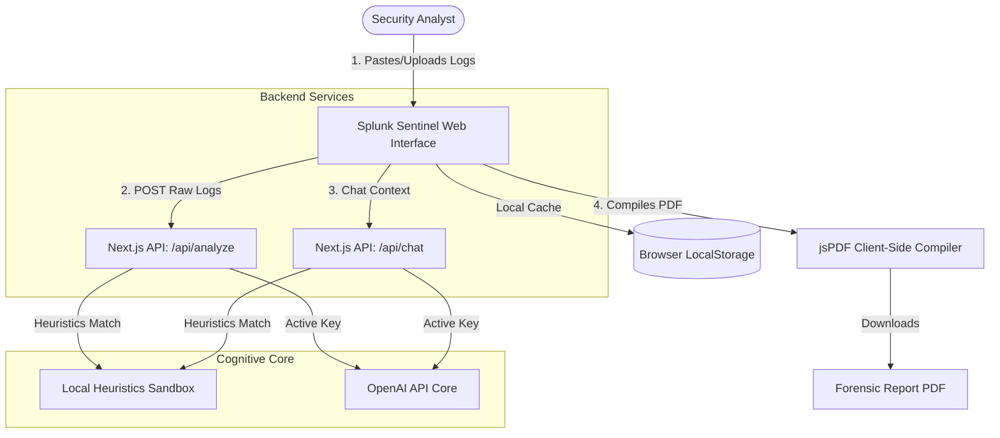
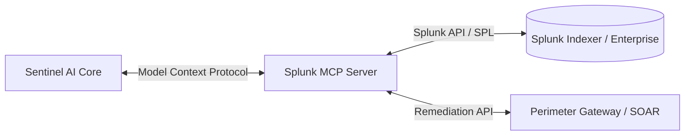

# 🛡️ Splunk Sentinel

**Splunk Sentinel** is an AI-powered, full-stack cybersecurity incident response platform designed for modern Security Operations Centers (SOC). It digests raw logs, correlates timelines, extracts indicators of compromise (IOCs), generates containment checklists, and allows security analysts to interactively query incident details using a contextual AI chatbot.

---

## 🚀 Key Features

- **📊 Modern SOC Dashboard**: Monitors real-time stats including total logs scanned, critical breaches, active investigations, and threat vector distribution.
- **🔍 Intelligent Log Analyzer**: Drag-and-drop log files or paste raw logs (SSH, Nginx web access, Windows AD security events, etc.) for direct AI forensic scanning.
- **⚡ Double-Engine Architecture (Hybrid AI)**:
  - **OpenAI Cognitive Engine**: Performs deep semantic analysis, threat classification, and root-cause reconstruction.
  - **Local Heuristics Sandbox (Zero-Config)**: Automatically analyzes standard presets locally if no OpenAI key is provided, ensuring instant out-of-the-box utility.
- **🔬 Automated Threat Report**: Extracts severity badges, threat categorizations, comprehensive technical root causes, mapped chronological timelines, and key IOC cards (Source IPs, Assets, Accounts, Signatures).
- **📋 Mitigation & Containment Roadmap**: Automatically generates actionable step-by-step containment checklists with real-time resolution progress tracking.
- **💬 Interactive AI Chat Coprocessor**: Chat directly with log contexts. Ask Sentinel to summarize IPs, write firewall block commands, or identify initial entry points.
- **📄 Professional PDF Export**: Compile and download comprehensive, multi-page security incident reports formatted for printing and C-suite reporting.
- **⚙️ Local Cache Persistence**: Instantly stores, deletes, filters, and loads incidents from the browser's `localStorage` (no database server config required).

---

## 🛠️ Tech Stack

- **Framework**: Next.js 15 (App Router)
- **Language**: JavaScript (CommonJS/ESM modules, no transpiler dependencies)
- **Styling**: Tailwind CSS v4 & PostCSS
- **AI Integration**: OpenAI SDK (compatible with `gpt-4o-mini`, `gpt-4o`)
- **PDF Core**: jsPDF (client-side compilation)
- **Icons**: Lucide React

---

## 🗺️ System Architecture



---

## 🚀 Getting Started

### Prerequisites

- [Node.js](https://nodejs.org/) (v18.0.0 or higher recommended)
- `npm` (packaged with Node.js)

### Installation

1. Clone or copy the project files to your desktop:
   ```bash
   cd Splunk
   ```

2. Install all dependencies:
   ```bash
   npm install
   ```

3. Run the development server:
   ```bash
   npm run dev
   ```

4. Open [http://localhost:3000](http://localhost:3000) in your browser to view the platform.

### Environment Configuration

To run live AI analysis, create a `.env.local` file in the root directory and add your OpenAI API Key:
```env
OPENAI_API_KEY=your-api-key-here
```
*Alternatively, you can input your API key directly on the **System Settings** page within the UI. This key will be saved securely in your browser cache and override the environment variable.*

---

## 🕹️ Demo Presets (Instant Evaluation)

Splunk Sentinel has four pre-configured sample incident logs designed for rapid evaluation and hackathon judging:
1. **SSH Brute Force Attack**: Traces invalid user logging attempts, successful devops compromise, and root privilege escalation.
2. **Web SQL Injection (SQLi)**: Identifies database schemas mapping, database dump exports, and PostgreSQL statement errors.
3. **Linux Privilege Escalation**: Audits webshell PHP executions, SUID scanning, and shadow hash exfiltration via GTFOBins.
4. **Impossible Travel Alert**: Detects concurrent VPN logons for `alice@corp.com` from New York and London within 15 minutes.

---

## 🔮 Future Splunk MCP Integration

Model Context Protocol (MCP) is an open-standard communication protocol that allows AI assistants to securely read and write data from local or remote servers. 

Integrating a **Splunk MCP Server** into Splunk Sentinel represents the next stage of autonomous security engineering:



### Key Capabilities of Splunk MCP Integration:
1. **Natural Language Splunk Queries**: Instead of writing complex SPL (Splunk Search Processing Language), the analyst can instruct the chatbot: *"Sentinel, query the index `security` for all SSH failures from the last 2 hours."* The AI translates this, queries the index via the MCP server, and processes the log array instantly.
2. **Autonomous Alerts Forensics**: When a Splunk alert triggers, the Splunk MCP server can stream the relevant log payloads directly to Sentinel, spawning a pre-analyzed incident report without manual analyst intervention.
3. **Bidirectional SOAR Actions**: The AI can issue remediation instructions back through the MCP server to trigger Splunk Phantom/SOAR playbooks, executing firewall lockouts, IP blocks, or AD account suspensions in real-time.
