# Splunk Sentinel V2.0

### AI-Powered Enterprise Security Operations Center (SOC) Copilot

---

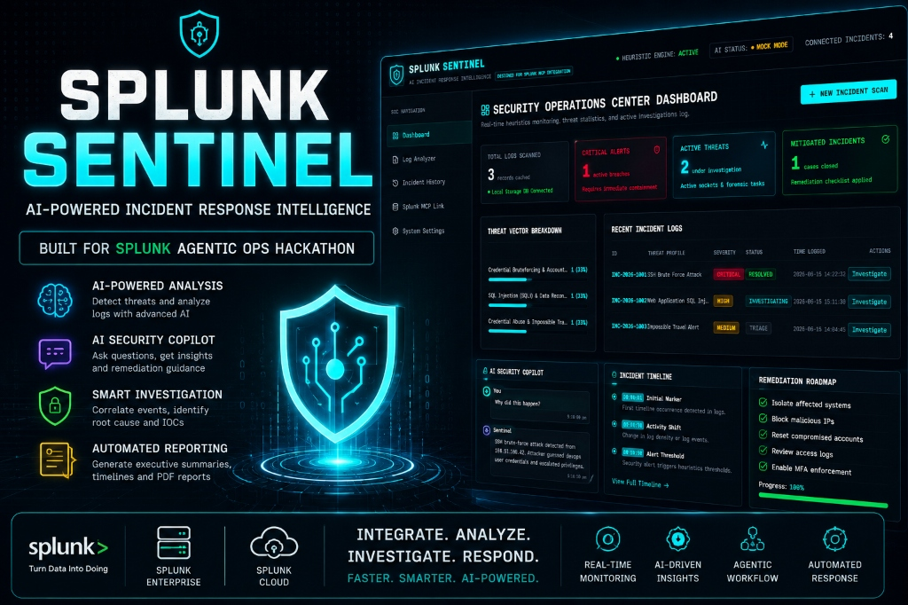

Splunk Sentinel V2.0 is an enterprise-grade AI-powered incident response and forensic analysis platform designed for modern Security Operations Centers (SOC). Tailored to integrate seamlessly with Splunk Enterprise and Splunk Cloud ecosystems, Splunk Sentinel ingests raw, unstructured security telemetry, automatically correlates events, translates complex system and authentication logs into structured chronologies, and assists analysts via a context-aware AI Security Coprocessor.

---

## ⚡ V2.0 Feature Breakdown

- **Secure Authentication & Session Persistence**: Integrated with Supabase Auth for persistent analyst logins and protected routes.
- **Granular Role-Based Access Control (RBAC)**: Supports three distinct SOC operational tiers (Admin, Security Analyst, and Viewer) to enforce separation of duties.
- **Dynamic Recharts Analytics**: High-performance visualizations displaying incident volume trends, severity spread, resolution rates, threat categories, and analyst workloads.
- **Persistent Incident Database**: Triaged security compromises, AI forensic records, timeline chronologies, and remediation roadmap progress are synced to Supabase PostgreSQL.
- **Analyst Audit Logs**: Centralizes all SOC team activities (logins, assignments, status changes, PDF exports) into a searchable live audit feed.
- **PDF Report Center**: An administrative control panel to search, filter, and archive generated PDF forensics reports.

---

## 📸 Platform Walkthrough

### 1. Authentication & Role-Based Access Control

<div align="center">
  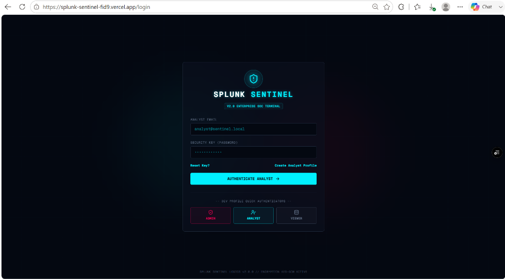
  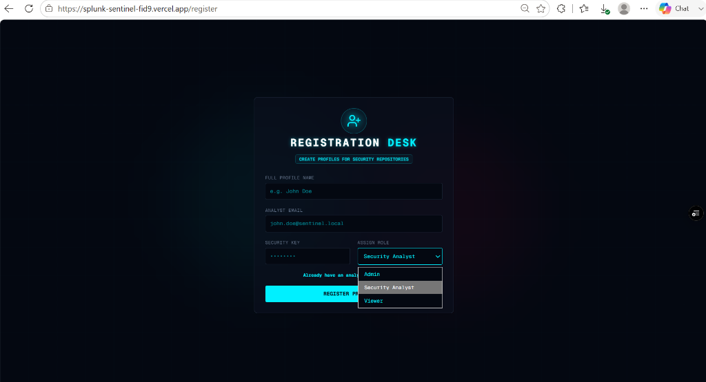
</div>

*Caption: The V2.0 login terminal and analyst registration dashboard featuring quick development authenticators.*

- **Description**: Standard-compliant credentials management panel with custom-styled input forms, secure route guards, and quick auth shortcuts.
- **Key Features**:
  - Encrypted credential handling.
  - Interactive profile registration with role assignments.
  - Instant session expiration on logout.
- **Role Permissions**: Checks credentials against database profiles to gate UI actions and features.

---

### 2. Security Operations Center (SOC) Dashboard

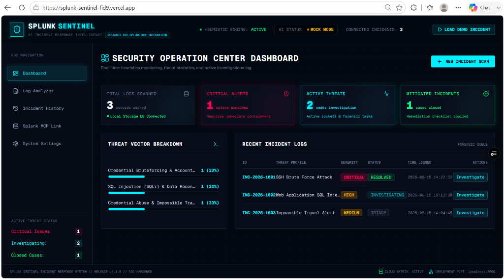

*Caption: Live SOC dashboard displaying dynamic analytics, metrics grids, and real-time active workload charts.*

- **Description**: Central analytics screen giving SOC leadership and analysts high-level oversight of ongoing alerts and triaging efficiency.
- **Key Features**:
  - Live incident counts and containment metrics.
  - Interactive charts powered by Recharts (volume trends, severity spread, resolution efficiency, workloads, threat categories).
  - Chronological live audit timeline feed reflecting team operations.
- **AI Role / Contribution**: Translates incident database tables into aggregated trends and categories dynamically.
- **Splunk Integration**: Supports monitoring and visualizing telemetry event volumes ingested from Splunk search heads.

---

### 3. Cognitive Log Analyzer

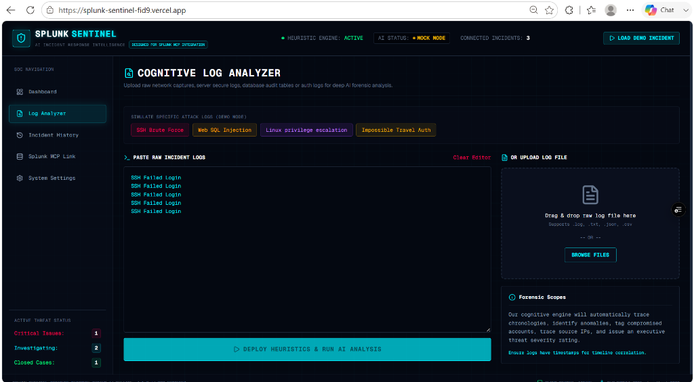

*Caption: The cognitive analyzer workspace supporting text log drops, file imports, and preset simulations.*

- **Description**: Interactive workspace where analysts paste raw system log segments, upload log dumps, or run preset breach vectors to start forensic triaging.
- **Key Features**:
  - Drag-and-drop log file reader.
  - Simulated templates (SSH Brute Force, SQL Injection, Sudo Privilege Escalation, Impossible Travel).
  - Progressive animated analyzer phases (IP reputation matching, heuristics routing, and logical schema parsing).
- **AI Role / Contribution**: Automatically isolates attacking source IPs, target assets, targeted accounts, and event signatures.
- **Splunk Integration**: Conceptually routes raw syslogs or JSON payloads to `/api/analyze` for on-demand investigation.

---

### 4. Manual Incident Creation

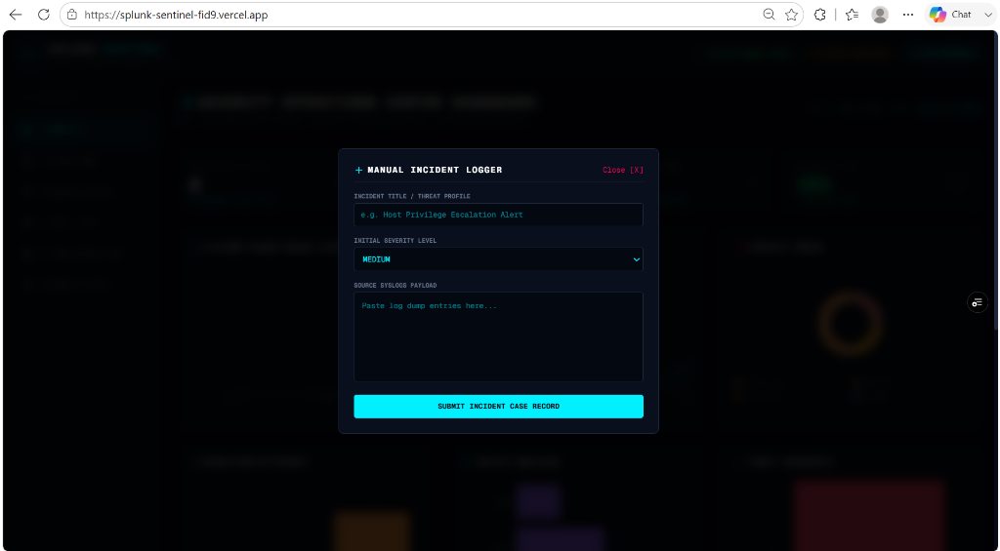

*Caption: Manual incident logger modal for recording ad-hoc alerts in the SOC database.*

- **Description**: Modal form permitting authorized analysts to manually log custom system alerts directly into the triaging queue.
- **Key Features**:
  - Form validation for incident titles, raw log dumps, and severity levels.
  - Auto-generated unique tracking numbers (e.g., INC-2026-4331).
  - Direct background database insertion.
- **AI Role / Contribution**: Instantly initializes case files with default containment recommendations.
- **Splunk Integration**: Simulates receiving syslog payloads directly from firewalls or application endpoints.

---

### 5. Incident History & Lifecycle Management

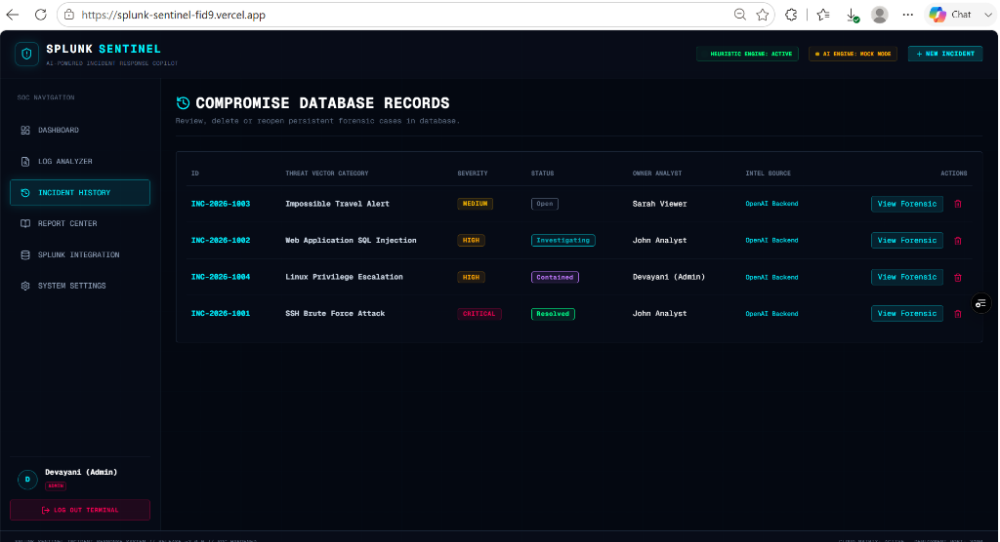

*Caption: Compromise database records management panel showing case files, severities, and owners.*

- **Description**: Central table listing all current and resolved incident records stored in the persistent database.
- **Key Features**:
  - Searchable list sorted chronologically.
  - Dynamic visual tags indicating case status and severity levels.
  - Quick access buttons to view forensic details or delete files (Admin-only).
- **Splunk Integration**: Stores telemetry reference markers and index identifiers mapping cases back to Splunk datasets.

---

### 6. Forensic Investigation Workspace & Chat Coprocessor

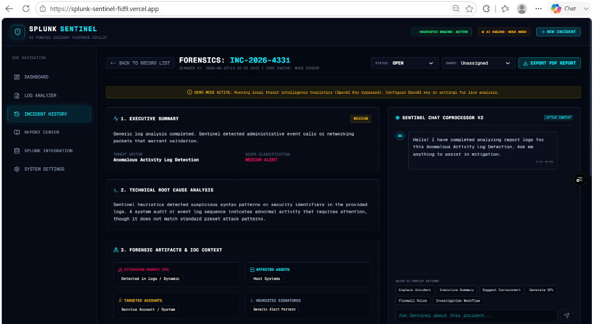

*Caption: Forensic Detail screen with AI executive summary, technical root cause, checklist, and Chat Coprocessor V2.*

- **Description**: Detailed case panel containing parsed IOC arrays, root cause analysis blocks, checkable remediation playbooks, and the context-aware chat coprocessor.
- **Key Features**:
  - Structured executive briefs and technical root cause analysis cards.
  - Dynamic checkable containment checklist that syncs resolution rates back to the database.
  - Context-aware chat coprocessor pre-seeded with case log contents.
  - Pre-seeded AI quick actions: *Explain Incident*, *Generate SPL Hunting Query*, *Suggest Containment*, *Suggest WAF Block Rules*, *Show Investigation Workflow*.
- **AI Role / Contribution**: Conducts logical reasoning based on raw logs, generates Splunk Search Processing Language (SPL) hunting queries, and provides customized containment checklists.
- **Splunk Integration**: The generated SPL queries can be copied directly and run in Splunk search heads to scan for similar breach signatures.

---

### 7. PDF Report Generation & Report Center

<div align="center">
  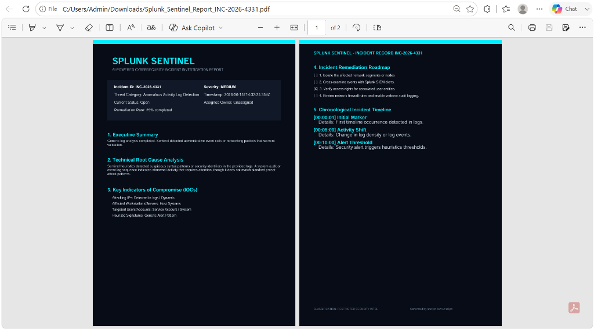
  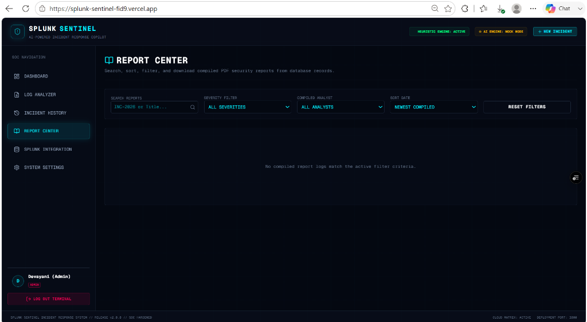
</div>

*Caption: Two-page PDF investigation report preview and the Report Center management board.*

- **Description**: Forensic PDF compiler that generates multi-page reports with executive summaries, technical root causes, compromised indicators, containment checklists, and analyst timelines. The Report Center tracks and archives all generated reports.
- **Key Features**:
  - Client-side PDF compilation using `jsPDF` with cyber-SOC styled elements.
  - Searchable Report Center filtering logs by severity, generating analyst, and date.
- **AI Role / Contribution**: Populates the report fields with structured threat intelligence descriptions.
- **Splunk Integration**: Captures final forensic reports for audit logging and archives.

---

### 8. Splunk Ingestion Workspace

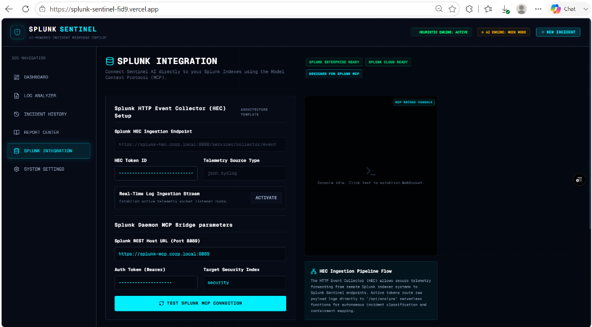

*Caption: Configuration board for HTTP Event Collector (HEC) logs streaming and Daemon MCP bridge connections.*

- **Description**: Integration panel to configure HTTP Event Collector (HEC) endpoints and Model Context Protocol (MCP) daemon setups.
- **Key Features**:
  - Form parameters for Splunk host URLs, indexes, and authentication tokens.
  - Live mock bridge console showing connection states and log streaming traces.
- **Splunk Integration**: Configures the ingestion endpoint to forward security telemetry from Splunk indexers directly to Splunk Sentinel.

---

### 9. System Configuration Panel

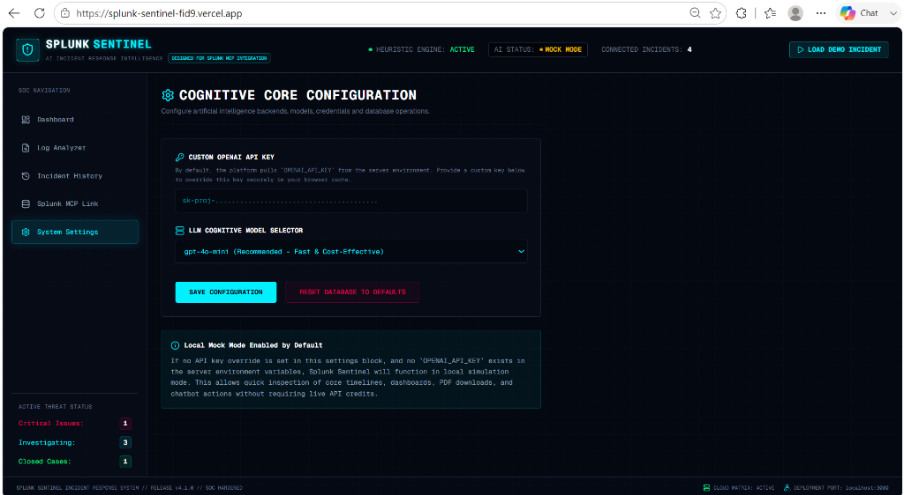

*Caption: Cognitive Core configuration dashboard for LLM API keys and model parameters.*

- **Description**: Configuration manager to save OpenAI API keys and toggle the active AI reasoning model.
- **Key Features**:
  - LocalStorage caching for user keys.
  - Dropdown selector supporting `gpt-4o` and `gpt-4o-mini` models.
- **AI Role / Contribution**: Gates the OpenAI SDK connection settings and configures the active reasoning engine.

---

## 🗄️ Supabase Database Schema

Splunk Sentinel V2.0 maps persistent SOC records to 5 PostgreSQL tables. Migrations are located in [supabase/migrations/20260615_init_schema.sql](supabase/migrations/20260615_init_schema.sql).

### 1. `users`
Profiles for user accounts linked to authentication IDs.
- `id` (UUID, Primary Key)
- `email` (VARCHAR, Unique)
- `full_name` (VARCHAR)
- `role` (VARCHAR: Admin, Security Analyst, Viewer)
- `created_at` (TIMESTAMPTZ)

### 2. `incidents`
Active security cases under triage or containment.
- `id` (VARCHAR, Primary Key) -- e.g. "INC-2026-1001"
- `title` (VARCHAR)
- `severity` (VARCHAR: LOW, MEDIUM, HIGH, CRITICAL)
- `status` (VARCHAR: Open, Investigating, Contained, Resolved)
- `raw_logs` (TEXT)
- `summary` (TEXT)
- `root_cause` (TEXT)
- `remediation_plan` (TEXT)
- `assigned_analyst` (VARCHAR)
- `created_at` (TIMESTAMPTZ)
- `updated_at` (TIMESTAMPTZ)

### 3. `reports`
Log registry of compiled and exported PDF files.
- `id` (UUID, Primary Key)
- `incident_id` (VARCHAR, Foreign Key referencing incidents.id)
- `name` (VARCHAR)
- `pdf_size_bytes` (INT)
- `generated_by` (VARCHAR)
- `created_at` (TIMESTAMPTZ)

### 4. `chat_sessions`
Message array history stored for the AI Coprocessor.
- `id` (UUID, Primary Key)
- `incident_id` (VARCHAR, Foreign Key referencing incidents.id)
- `user_name` (VARCHAR)
- `message_payload` (JSONB)
- `created_at` (TIMESTAMPTZ)

### 5. `audit_logs`
Chronological trails of user changes and actions in the SOC.
- `id` (UUID, Primary Key)
- `user_name` (VARCHAR)
- `user_role` (VARCHAR)
- `action` (TEXT)
- `incident_id` (VARCHAR, Nullable)
- `created_at` (TIMESTAMPTZ)

---

## 🔐 Role-Based Permissions Matrix

| Dashboard Area / Action | Admin | Security Analyst | Viewer |
| :--- | :---: | :---: | :---: |
| View Dashboards & Charts | ✓ | ✓ | ✓ |
| View Incident Records | ✓ | ✓ | ✓ |
| Search & Export PDF Reports | ✓ | ✓ | ✓ |
| Paste Logs & Run Heuristics | ✓ | ✓ | Locked |
| Toggle Containment Checklist | ✓ | ✓ | Locked |
| Chat with Logs Coprocessor | ✓ | ✓ | Locked |
| Edit Case Status & Owner | ✓ | ✓ | Locked |
| Create Custom Incidents | ✓ | ✓ | Locked |
| Modify System Settings | ✓ | Locked | Locked |
| Delete Incident Records | ✓ | Locked | Locked |

### 📸 RBAC Verification Screenshots

1. **Admin Full Access**:
   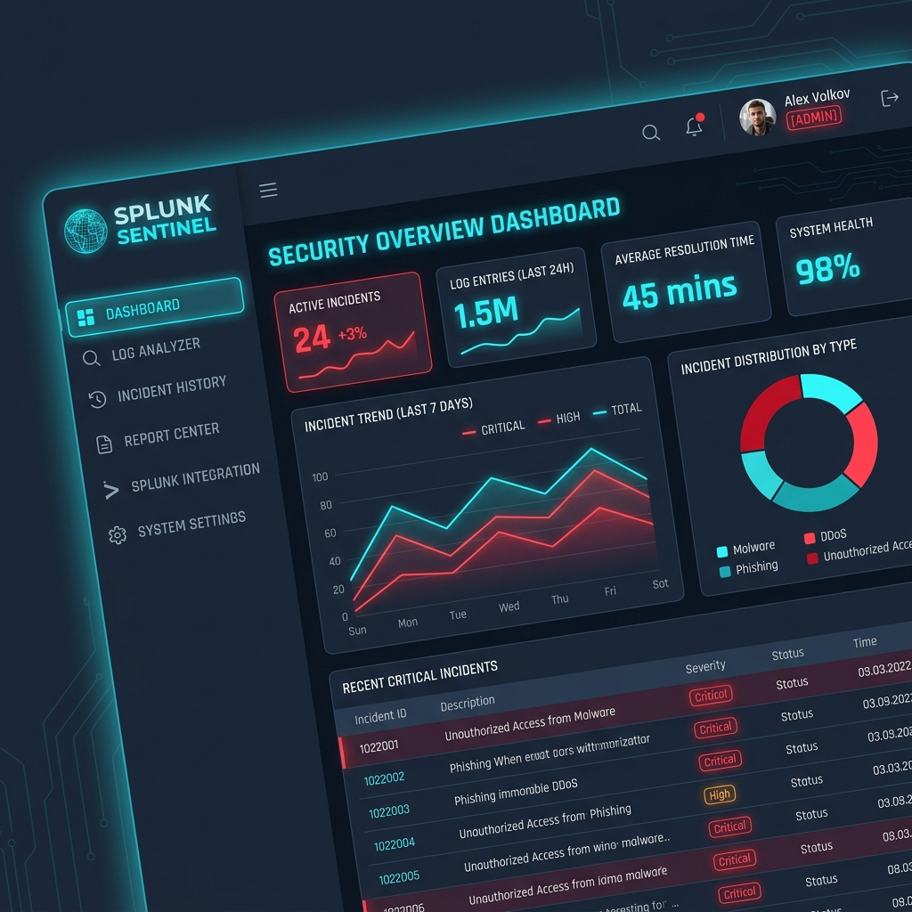
   *Caption: Admin view displaying full sidebar navigation tabs and operational controls.*

2. **Analyst Restricted Access**:
   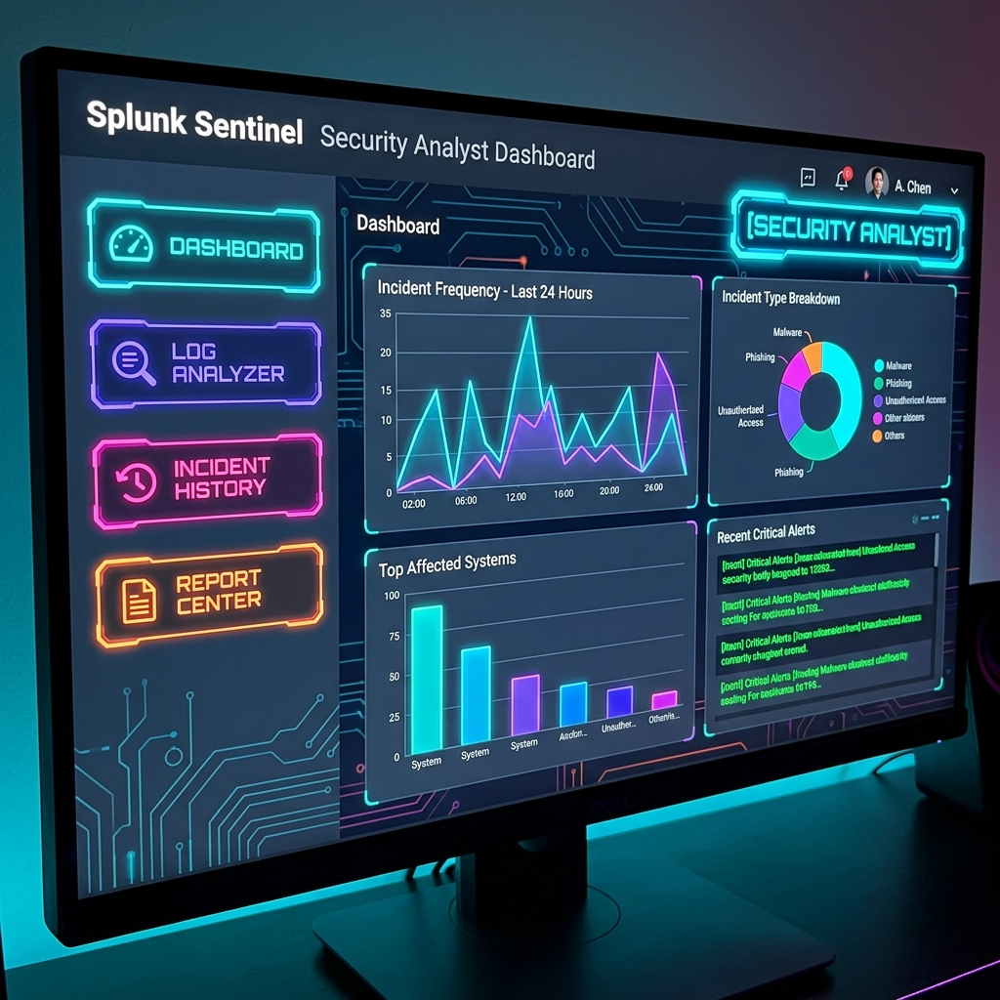
   *Caption: Analyst view restricting system settings and Splunk bridge configurations.*

3. **Viewer Restricted Access**:
   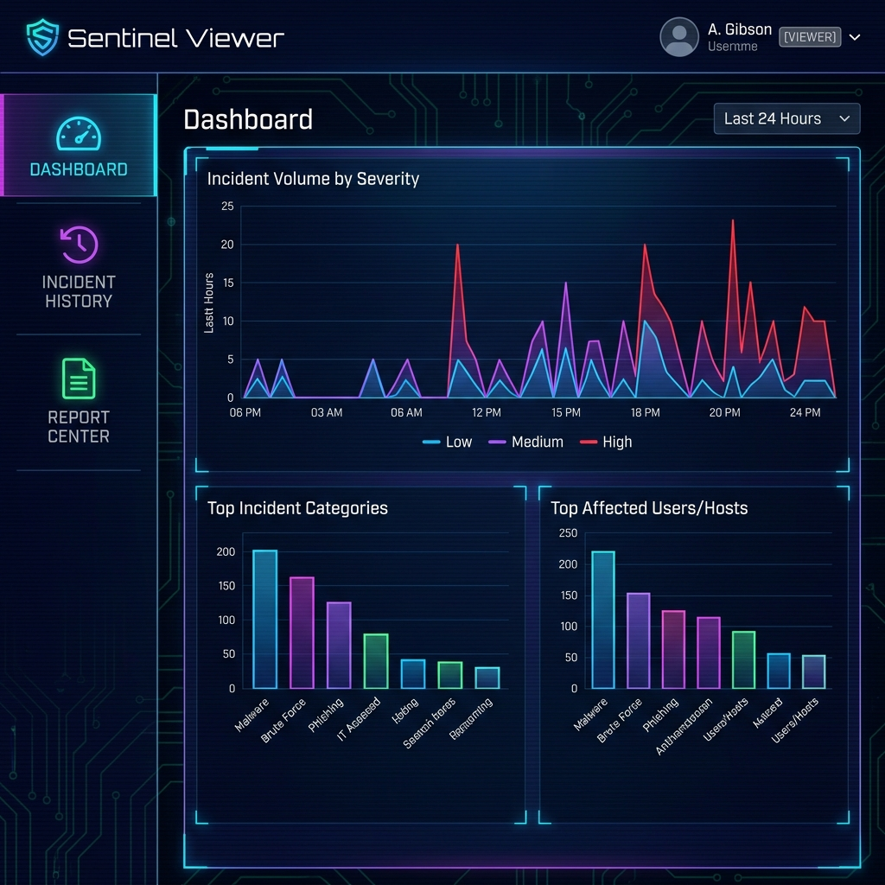
   *Caption: Viewer view showing restricted sidebar navigation and locked incident logs/chat functions.*

4. **Viewer Access Denied Page**:
   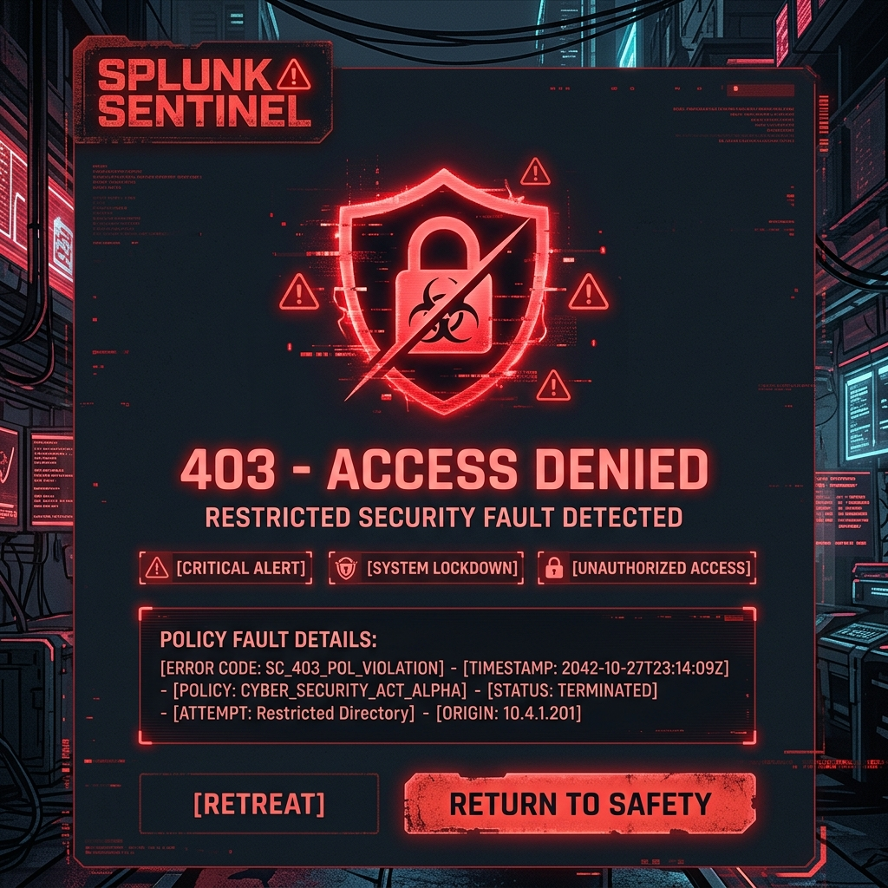
   *Caption: Premium Access Denied terminal displayed when accessing unauthorized panels directly.*

5. **Hidden Navigation Comparison**:
   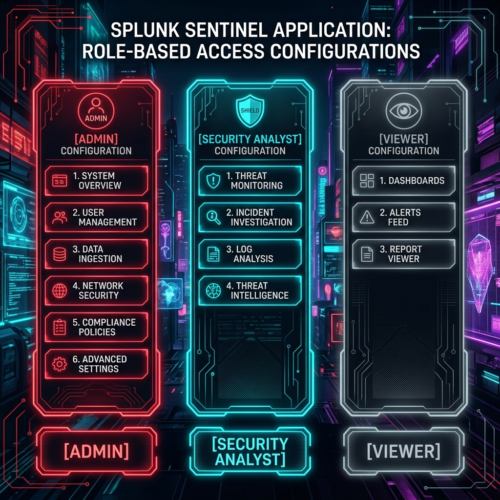
   *Caption: Comparison showing how navigation controls auto-adapt based on authorization level.*

---

## 🔁 Data Flow Architecture

```
Splunk Enterprise / Splunk Cloud
      ↓
Security Telemetry (raw web server logs, auth events, system traces)
      ↓
Splunk Sentinel Ingestion Layer (ingests logs via HEC API or file upload)
      ↓
AI Threat Analysis Engine (LLM-driven logical reasoning mapping threat vectors)
      ↓
Incident Correlation Engine (parses and structures timelines, severities, and targets)
      ↓
Sentinel Chat Coprocessor (interactive chat interface for deep forensic queries)
      ↓
Remediation Recommendations (issues custom actionable containment checklists)
      ↓
PDF Investigation Report (downloads executive-ready forensics and containment summary)
```

---

## 🚀 Installation & Setup

1. **Clone the Repository**:
   ```bash
   git clone https://github.com/ByteBlaze1706/Splunk-Sentinel.git
   cd Splunk-Sentinel
   ```
2. **Install Dependencies**:
   ```bash
   npm install
   ```

---

## 🔑 Environment Variables

To connect to your database and enable live logic engines, create a `.env.local` file at the root:
```env
# Supabase Persistence Credentials (Optional)
NEXT_PUBLIC_SUPABASE_URL=https://your-project-id.supabase.co
NEXT_PUBLIC_SUPABASE_ANON_KEY=eyJhbGciOiJIUzI1NiIsInR5cCI6IkpXVCJ9...

# OpenAI Cognitive Brain Credentials (Optional)
OPENAI_API_KEY=sk-proj-your-api-key-here
```
*Note: If credentials are not specified, Splunk Sentinel will automatically bootstrap in **Mock Mode** using persistent LocalStorage databases and offline heuristic sandboxes. You can test all views, quick logins, assignment changes, chats, and report exports out-of-the-box.*

---

## 💻 Local Development

Start the Next.js development server:
```bash
npm run dev
```
Open `http://localhost:3000` to access the SOC terminal.

---

## 🌐 Deployment Guide

This project is configured for one-click deployment on **Vercel**:

### Option 1: Vercel CLI (Recommended)
1. Install Vercel CLI:
   ```bash
   npm install -g vercel
   ```
2. Deploy the project (in non-interactive mode):
   ```bash
   vercel --yes
   ```
3. Promote the build to production:
   ```bash
   vercel --prod --yes
   ```

---

## 📄 License

This project is licensed under the MIT License. See [LICENSE](LICENSE) for details.
