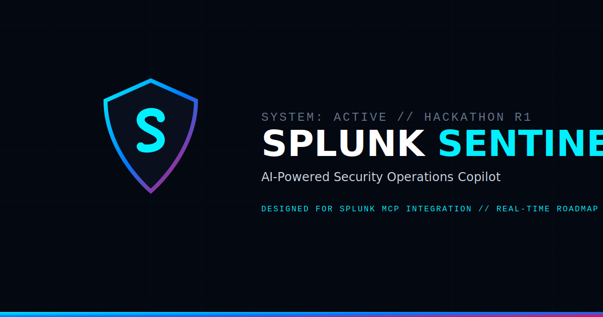

# Splunk Sentinel

AI-Powered Security Operations Copilot for Threat Detection, Incident Investigation, and Automated Response.

---

## 📖 Problem Statement
Security Operations Centers (SOCs) are overwhelmed by an exponential volume of raw log data and alert fatigue. Analysts face three primary challenges:
1. **Time-to-Triage**: Reviewing thousands of lines of logs to identify the initial vector, threat category, and root cause is manually intensive.
2. **Context Fragmentation**: Moving between SIEM search heads, external reputation directories, and local checklists delays containment.
3. **Delayed Action Plans**: Translating complex logs into actionable containment playbooks or reports for executive sign-off slows down threat containment.

---

## 💡 Solution
**Splunk Sentinel** acts as a cognitive co-pilot that sits alongside the analyst. By combining heuristics-based analysis (for local offline safety) and LLM analysis (for semantic reasoning), Sentinel:
- Automatically parses threat details (Attack vector, root cause, timeline).
- Recomends containment checklists with an interactive task manager.
- Provides a context-aware chat assistant that answers direct forensic questions using the logs' context.
- Exports executive-ready PDF containment reports with a single click.
- Prepares operations for the next generation of Splunk Model Context Protocol (MCP) integrations.

---

## 🔁 How Splunk Fits Into The Workflow
- **Splunk generates and stores security telemetry**: Splunk indexers actively compile authorization logs, web server traces, system shell metrics, and network packets from enterprise assets.
- **Splunk Sentinel consumes Splunk-generated events**: Raw event alerts are streamed from Splunk Cloud/Enterprise indices directly to Sentinel’s analysis pipeline.
- **AI analyzes incidents**: The AI Threat Analysis Engine extracts key IOC metrics (attacks vector, timeline, signatures) and calculates a severity score.
- **Analysts interact through the Sentinel Coprocessor**: Incident responders converse directly with the context-aware chatbot to investigate details or retrieve SPL query help.
- **AI generates remediation plans and reports**: Sentinel automatically compiles step-by-step containment checklists and exports C-suite restricted PDF reports.

---

## 🛠️ Features
- **📊 Operational SOC Dashboard**: Highlights key metric cards (Total Scanned, Critical Alerts, Active cases, Mitigated rate) and threat vector distribution.
- **🔍 Intelligent Log Analyzer**: Drag-and-drop log uploader and code editor with preset logs loaders.
- **🔬 Dynamic Report Details**: Automatically displays critical indicators, key artifacts (Source IPs, affected systems, compromised accounts, signatures), and event timelines.
- **📋 Containment Checklist**: Displays an interactive checklist where checking items updates the overall containment rate.
- **💬 Technical Chat Coprocessor**: An in-app technical chat assistant to query logs (e.g., "Suggest block rules", "What user was compromised?").
- **📄 Professional PDF Export**: Compiles and exports complete incident details into a multi-page, SOC-restricted PDF.
- **⚙️ Configurable AI Engines**: Pulsing badges identify whether the report was generated by the **Mock Engine** (heuristic sandbox) or **OpenAI Analysis** (live API integrations).

---

## 🎨 Social Preview & Branding
Here is a preview of the Splunk Sentinel identity:



---

## 🗺️ Architecture Diagram


---

## 💻 Tech Stack
- **Framework**: Next.js 15 (App Router, JavaScript-only configuration)
- **Styling**: Tailwind CSS v4 & PostCSS
- **State Management**: React State Hooks & lazy `localStorage` initializers (purity-safe)
- **AI Integration**: OpenAI SDK
- **PDF Core**: jsPDF (client-side)
- **Iconography**: Lucide React

---

## 🚀 Setup Instructions

1. Clone or clone the repository:
   ```bash
   cd Splunk-Sentinel
   ```
2. Install dependencies:
   ```bash
   npm install
   ```
3. Run the development server:
   ```bash
   npm run dev
   ```
4. Access the web interface at `http://localhost:3000`.

---

## 🔑 Environment Variables
To enable live OpenAI completions, create a `.env.local` file at the root:
```env
OPENAI_API_KEY=sk-proj-your-api-key-here
```
*Note: If no API key is specified in the environment variables, the platform automatically starts in **Mock Mode**, allowing you to test all buttons, analyzers, chatbots, and PDF download functions using local heuristics presets.*

---

## 🌐 Deployment Guide
This project is configured for one-click deployment on **Vercel**:

### Option 1: Vercel CLI (Recommended)
1. Install the Vercel CLI:
   ```bash
   npm install -g vercel
   ```
2. Deploy the project (in non-interactive mode):
   ```bash
   vercel --yes
   ```
3. Promote the preview build to production:
   ```bash
   vercel --prod --yes
   ```

### Option 2: GitHub Integration
1. Push this repository to your GitHub account.
2. Link the repository to your Vercel Dashboard.
3. Configure `OPENAI_API_KEY` under the project environment variables if live completions are desired.
4. Trigger the deployment.

---

## 🔮 Splunk MCP Roadmap
Model Context Protocol (MCP) bridges LLM models with remote server contexts. In Splunk Sentinel, an MCP integration allows direct access to search heads:

1. **Splunk Enterprise & Splunk Cloud support**: Authenticates directly with Splunk REST endpoints using secure bearer tokens.
2. **Splunk MCP Link**: Establishes a WebSocket JSON-RPC bridge between the AI model and the Splunk Daemon.
3. **Real-time Log Streaming**: Attaches listeners directly to Splunk HEC (HTTP Event Collector) for real-time breach detection.
4. **Agentic Security Operations**: Deploys autonomous AI search agents to hunt for advanced persistent threats (APTs) using SPL queries.
5. **SOAR Playbooks Sync**: Automatically maps completed remediation items in the containment checklist to Splunk Phantom SOAR playbooks.

---

## 🚀 Future Enhancements
- **Multi-tenant SOC view**: Toggle between multiple active client networks.
- **Custom SPL Translators**: Translate natural language commands directly to Splunk search commands.
- **Encrypted Local Storage**: Encrypt cached logs on local disks to secure PII.

---

## 🛡️ Built For Splunk Agentic Ops Hackathon
*Splunk Sentinel has been designed and built specifically for the Splunk Agentic Ops Hackathon 2026. The platform demonstrates how Model Context Protocols (MCP) can bridge autonomous cognitive agents directly into SIEM operations.*
