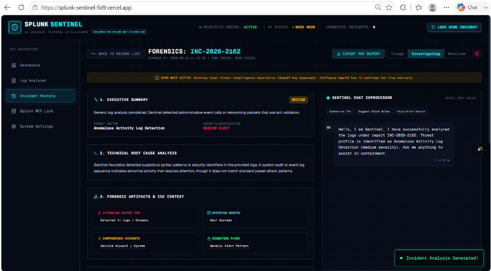
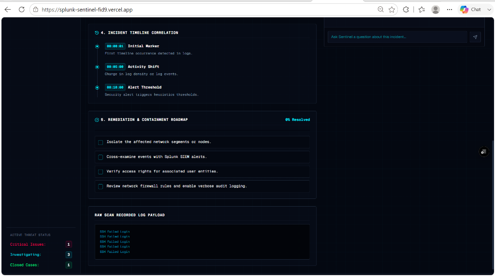
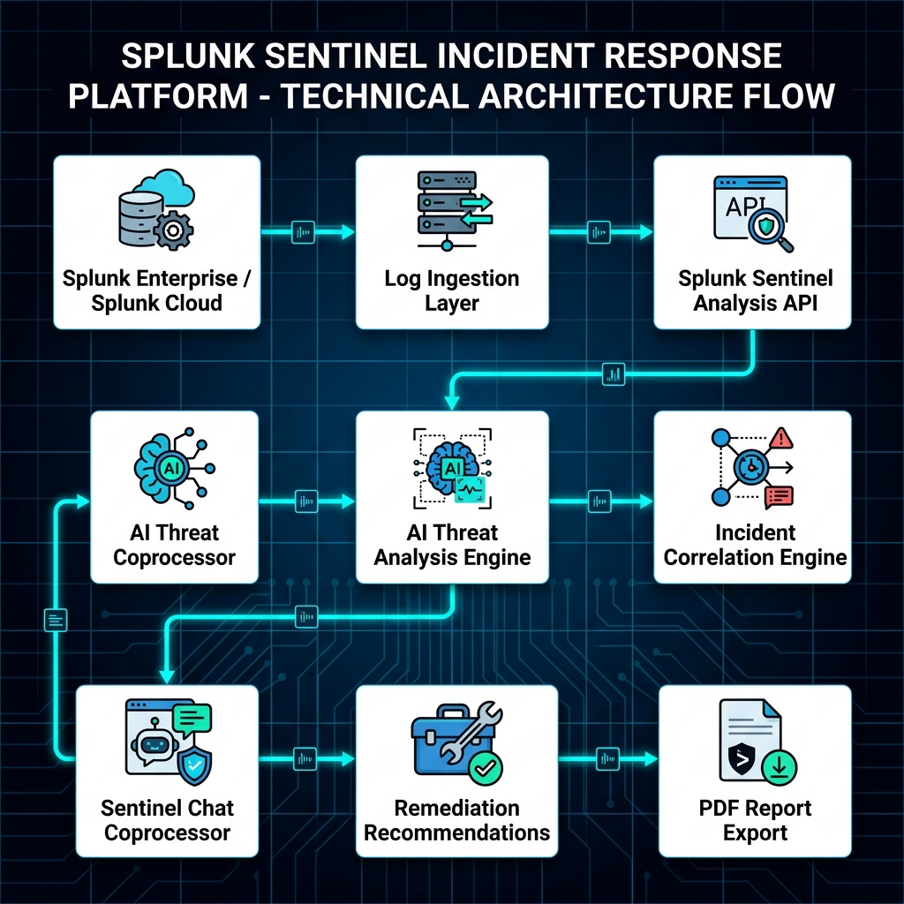
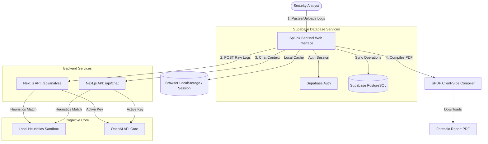

# Splunk Sentinel V2.0

AI-Powered Enterprise Security Operations Center (SOC) Copilot.

Splunk Sentinel V2.0 elevates the platform from a hackathon demo into a production-grade multi-user incident response platform. It integrates secure user authentication, role-based access control, real-time database persistence, interactive telemetry analytics, detailed timeline auditing, and a dedicated reports management center.

---

## ⚡ V2.0 Core Upgrades
1. **Authentication & Session Persistence**: Integrated with Supabase Auth for persistent analyst logins and protected routes.
2. **Role-Based Access Control (RBAC)**: Supports three operational tiers:
   - **Admin**: Full authority to edit, assign, delete cases, and configure integrations.
   - **Security Analyst**: Core investigation authority (analyze logs, toggle containment checklist tasks, interact with AI).
   - **Viewer**: Read-only oversight access (Dashboard, Reports, History, Splunk MCP views). Cannot run scans or modify data.
3. **Analytics Dashboard**: Outfitted with dynamic **Recharts** visualizations displaying incident volume trends, severity spread, resolution rates, threat categories, and analyst workloads.
4. **Persistent Case Databases**: Stores raw events, timelines, AI forensic details, and containment progress in persistent PostgreSQL tables.
5. **Analyst Timeline Audits**: Records all terminal actions (user logins, assignments, status changes, PDF exports) into a central timeline.
6. **SOC Report Center**: Filters, searches, and manages generated PDF forensic summaries.
7. **Splunk HTTP Event Collector (HEC)**: Added architecture-ready configurations to stream live log feeds.

---

## 📸 Screenshots & Features

### 1. Security Operations Center Dashboard

*Caption: Splunk Sentinel SOC Dashboard showing live database metrics, Recharts volume trends, severity distribution, analyst workload bar charts, and the live audit timeline feed.*
- **Description**: Displays aggregated security telemetry, critical alert counters, active workloads, and the system activity timeline.
- **AI Contribution**: Continuously maps incident workloads and groups them into chronological trends.
- **Splunk Integration**: Visualizes event counts streaming from Splunk endpoints.

---

### 2. Cognitive Log Analyzer

*Caption: The Log Analyzer sandbox for pasting raw log strings or uploading log files.*
- **Description**: Features dropzones and preset simulators (SSH Brute Force, Web SQL Injection, Linux privilege escalation, Impossible Travel Auth) for immediate forensic classification.
- **AI Contribution**: Decrypts raw security logs to produce structured incident timelines and containment checklists.

---

### 3. AI Incident Investigation Report

*Caption: Forensic Detail View displaying parsed root cause summaries and extracted IOC indicators.*
- **Description**: Converts unreadable log dumps into human-readable briefs containing attacker IPs, target hosts, and compromised credentials.
- **AI Contribution**: Parses attacker routes and determines incident root cause.

---

### 4. Sentinel Chat Coprocessor V2

*Caption: The Chat Coprocessor panel with pre-seeded query shortcuts for quick containment commands.*
- **Description**: Context-aware chat panel pre-seeded with case log contents. Features quick-actions like generating SPL hunting queries, recommending WAF block rules, or detailing containment checklists.
- **AI Contribution**: Translates natural language into command blocks and MITRE ATT&CK maps.

---

### 5. Timeline Correlation & Remediation

*Caption: Incident timeline correlation details and actionable containment checklists.*
- **Description**: Maps threat times into chronological logs and issues checkable mitigation checklists that update case resolution scores.

---

### 6. Splunk MCP Integration Workspace

*Caption: The Splunk Integration configuration workspace.*
- **Description**: Maps remote Splunk REST daemon endpoints and WebSocket JSON-RPC interfaces.
- **Splunk Integration**: Supports connecting directly to port 8089 to query indices.

---

### 7. Cognitive Core Configuration

*Caption: Core settings workspace.*
- **Description**: Manages OpenAI API credentials and toggles logical reasoning models (gpt-4o, gpt-4o-mini).

---

## 🔁 How Splunk Fits Into The Workflow
```
Splunk Enterprise / Splunk Cloud
      ↓
Security Telemetry (raw web server logs, auth events, system traces)
      ↓
Splunk Sentinel Ingestion Layer (ingests logs via API or file upload)
      ↓
AI Threat Analysis Engine (LLM-driven logical reasoning mapping threat vectors)
      ↓
Incident Correlation Engine (parses and structures timelines, severities, and targets)
      ↓
Sentinel Chat Coprocessor (interactive chat interface for deep forensic queries)
      ↓
Remediation Recommendations (issues custom actionable containment checklists)
      ↓
PDF Investigation Report (downloads executive-ready forensics and containment summary)
```

---

## 🗺️ System Architecture



---

## 🗄️ Supabase Database Schema

Splunk Sentinel V2.0 utilizes 5 main persistent tables in its database schema. Migrations are stored in [supabase/migrations/20260615_init_schema.sql](supabase/migrations/20260615_init_schema.sql).

### 1. `users`
Profiles for user accounts linked to authentication IDs.
- `id` (UUID, Primary Key)
- `email` (VARCHAR, Unique)
- `full_name` (VARCHAR)
- `role` (VARCHAR: Admin, Security Analyst, Viewer)
- `created_at` (TIMESTAMPTZ)

### 2. `incidents`
Active security cases under triage or containment.
- `id` (VARCHAR, Primary Key) -- e.g. "INC-2026-1001"
- `title` (VARCHAR)
- `severity` (VARCHAR: LOW, MEDIUM, HIGH, CRITICAL)
- `status` (VARCHAR: Open, Investigating, Contained, Resolved)
- `raw_logs` (TEXT)
- `summary` (TEXT)
- `root_cause` (TEXT)
- `remediation_plan` (TEXT)
- `assigned_analyst` (VARCHAR)
- `created_at` (TIMESTAMPTZ)
- `updated_at` (TIMESTAMPTZ)

### 3. `reports`
Log registry of compiled and exported PDF files.
- `id` (UUID, Primary Key)
- `incident_id` (VARCHAR, Foreign Key referencing incidents.id)
- `name` (VARCHAR)
- `pdf_size_bytes` (INT)
- `generated_by` (VARCHAR)
- `created_at` (TIMESTAMPTZ)

### 4. `chat_sessions`
Message array history stored for the AI Coprocessor.
- `id` (UUID, Primary Key)
- `incident_id` (VARCHAR, Foreign Key referencing incidents.id)
- `user_name` (VARCHAR)
- `message_payload` (JSONB)
- `created_at` (TIMESTAMPTZ)

### 5. `audit_logs`
Chronological trails of user changes and actions in the SOC.
- `id` (UUID, Primary Key)
- `user_name` (VARCHAR)
- `user_role` (VARCHAR)
- `action` (TEXT)
- `incident_id` (VARCHAR, Nullable)
- `created_at` (TIMESTAMPTZ)

---

## 🔐 Role-Based Permissions Matrix

| Dashboard Area / Action | Admin | Security Analyst | Viewer |
| :--- | :---: | :---: | :---: |
| View Dashboards & Charts | ✓ | ✓ | ✓ |
| View Incident Records | ✓ | ✓ | ✓ |
| Search & Export PDF Reports | ✓ | ✓ | ✓ |
| Paste Logs & Run Heuristics | ✓ | ✓ | Locked |
| Toggle Containment Checklist | ✓ | ✓ | Locked |
| Chat with Logs Coprocessor | ✓ | ✓ | Locked |
| Edit Case Status & Owner | ✓ | ✓ | Locked |
| Create Custom Incidents | ✓ | ✓ | Locked |
| Modify System Settings | ✓ | Locked | Locked |
| Delete Incident Records | ✓ | Locked | Locked |

---

## 🚀 Installation & Setup
1. Clone the repository:
   ```bash
   git clone https://github.com/ByteBlaze1706/Splunk-Sentinel.git
   cd Splunk-Sentinel
   ```
2. Install dependencies:
   ```bash
   npm install
   ```

---

## 🔑 Environment Variables
To connect to your database and enable live logic engines, create a `.env.local` file at the root:
```env
# Supabase Persistence Credentials (Optional)
NEXT_PUBLIC_SUPABASE_URL=https://your-project-id.supabase.co
NEXT_PUBLIC_SUPABASE_ANON_KEY=eyJhbGciOiJIUzI1NiIsInR5cCI6IkpXVCJ9...

# OpenAI Cognitive Brain Credentials (Optional)
OPENAI_API_KEY=sk-proj-your-api-key-here
```
*Note: If credentials are not specified, Splunk Sentinel will automatically bootstrap in **Mock Mode** using persistent LocalStorage databases and offline heuristic sandboxes. You can test all views, quick logins, assignment changes, chats, and report exports out-of-the-box.*

---

## 💻 Local Development
Start the Next.js development server:
```bash
npm run dev
```
Open `http://localhost:3000` to access the SOC terminal.

---

## 🌐 Deployment Guide
This project is configured for one-click deployment on **Vercel**:

### Option 1: Vercel CLI (Recommended)
1. Install the Vercel CLI:
   ```bash
   npm install -g vercel
   ```
2. Deploy the project (in non-interactive mode):
   ```bash
   vercel --yes
   ```
3. Promote the build to production:
   ```bash
   vercel --prod --yes
   ```

---

## 📄 License
This project is licensed under the MIT License. See [LICENSE](LICENSE) for details.
