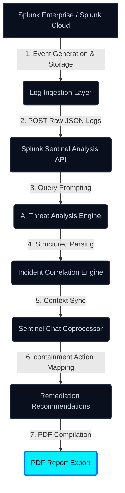

# Splunk Sentinel Architecture Flow

This document details the data and service architecture flow of **Splunk Sentinel**, tracing how raw security logs are ingested, analyzed, and mitigated.

## 🗺️ Visual Architecture Diagram

Here is the visual diagram for the system:

---

## 🔁 Chronological Data Flow

---

## 🔬 Component Descriptions

1. **Splunk Enterprise / Splunk Cloud**: The system of record for all security telemetry. It collects and indexes system events, auth triggers, and network packets.
2. **Log Ingestion Layer**: Consumes raw log streams from Splunk dashboards, saved searches, or HEC (HTTP Event Collector) hooks.
3. **Splunk Sentinel Analysis API**: Next.js App Router route `/api/analyze`. Accepts log text and targets them for analysis.
4. **AI Threat Analysis Engine**: Leverages the OpenAI SDK (or local heuristics fallback) to analyze security context.
5. **Incident Correlation Engine**: Parses the AI's output to extract severity badges, target endpoints, attacking source IPs, and chronological timelines.
6. **Sentinel Chat Coprocessor**: An interactive, context-aware chatbot allowing analysts to converse directly with logs.
7. **Remediation Recommendations**: Evaluates threat parameters to output a containment checklist.
8. **PDF Report Export**: compiles all forensically gathered data into a secure PDF report.
