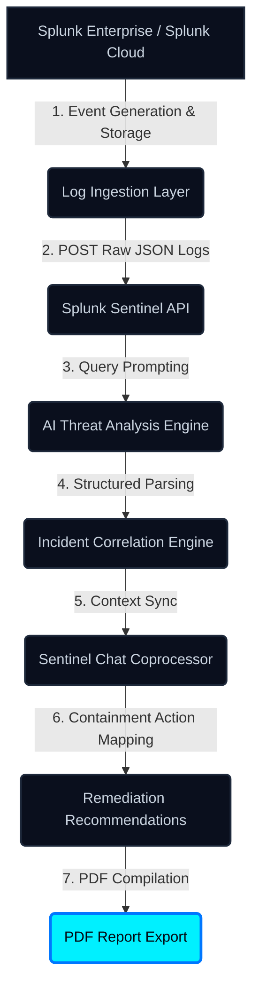

# Splunk Sentinel Architecture Flow

This document details the data and service architecture flow of **Splunk Sentinel**, tracing how raw security logs are ingested, analyzed, and mitigated.

## 🗺️ Visual Architecture Diagram

Here is the visual diagram for the system:

---

## 🔁 Chronological Data Flow

---

## 🔬 Component Descriptions

1. **Splunk Enterprise / Splunk Cloud**: The system of record for all security telemetry. It collects and indexes system events, authorization logs, and network packets.
2. **Log Ingestion Layer**: Consumes raw log streams from Splunk dashboards, saved searches, or HEC (HTTP Event Collector) hooks, acting as the entry point for raw telemetry.
3. **Splunk Sentinel API**: Next.js App Router route `/api/analyze`. Accepts log text inputs and formats them for the cognitive completion backend.
4. **AI Threat Analysis Engine**: Leverages the OpenAI completion SDK (or local heuristics fallback) to analyze security log context, classify threat vectors, and determine severity.
5. **Incident Correlation Engine**: Parses the raw response payload to extract structured indicators of compromise (compromised accounts, source IPs, affected endpoints, signatures) and maps out a chronologically sorted event timeline.
6. **Sentinel Chat Coprocessor**: An interactive, context-aware chatbot allowing analysts to converse directly with logs, generating SPL search commands or shell block scripts.
7. **Remediation Recommendations**: Evaluates threat parameters to output a customized step-by-step mitigation and containment checklist.
8. **PDF Report Export**: Compiles all gathered forensic data and action checklists into a clean, multi-page, SOC-restricted PDF report for executive verification.
